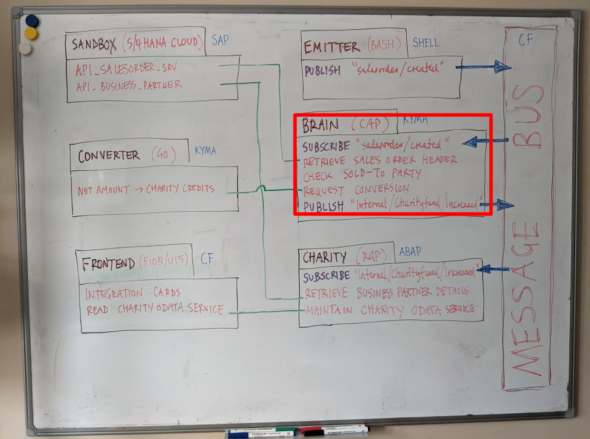

# BRAIN

This section relates to BRAIN component, the service that coordinates the event messages, subscribes to the "salesorder/created" topic, and publishes event messages to the "Internal/Charityfund/Increased" topic, and is represented by the "BRAIN" block in the whiteboard diagram.



## Overview

The brain is a basic CAP application with two of the three layers in use. In effect, a "service" more than an application:

|Layer|Description|
|-|-|
|`app`|Unused|
|`srv`|A single service `teched` is defined exposing an entity `CharityEntry`. Custom JavaScript code for managing the Brain's operations and activities|
|`db`|An entity `CharityEntry` is defined with a `SoldToParty` property as key, and a counter property. This entity is defined within the namespace `charity`|

The service, once deployed, does not require any human intervention to function. It performs the following activities, each time an event published to the "salesorder/created" topic on the messaging bus is received:

1. Unpacks the event data to get the sales order number
1. Retrieves sales order header details from the Sandbox (S/4HANA mock system) OData service `API_SALES_ORDER_SRV`
1. Checks to make sure that the sold-to party is one that hasn't already been processed 10 times before (aborting if so)
1. Requests a conversion of the total net amount of the sales order to the equivalent in charity fund credits, by calling the Converter (Go microservice) conversion service
1. Publishes a new event to the "Internal/Charityfund/Increased" topic, with the properties listed below

The properties in the event published by this CAP service are:

|Property|Description|
|-|-|
|`salesorder`|The sales order number|
|`custid`|The sold-to party ID (not the name)|
|`creationdate`|The date that the sales order was created|
|`credits`|The charity fund credits equivalent of the sales order total net amount|
|`salesorg`|The sales organisation that the sales order belongs to|

## Remote services defined and used

The CAP service consumes the following services which are defined in `package.json`. Some of these employ destinations defined in the cloud (on CF - see below):

|Name|Kind|Details|
|-|-|-|
|`messaging`|`enterprise-messaging`|Connection to the message bus|
|`db`|`sqlite`|Local persistence|
|`S4SalesOrders`|`odata`|Connection to the API Hub sandbox (SAP S/4HANA Cloud mock system) OData service. Destination `apihub_mock_salesorders`|
|`ConversionService`|`rest`|Connection to the Converter (Go microservice) conversion service. Destination `charityfund_converter`|


## On CF

The CAP service has been deployed to the collab CF org/space 9e079cc4trial/dev as app [`brain`](brain.cfapps.eu10.hana.ondemand.com) and has bindings to the following service instances in that same space:

|Name|Service|
|-|-|
|`destination-lite`|Destination service instance with 'lite' plan, to enable the CAP service to access destinations|
|`emdev`|Enterprise Messaging service instance with 'dev' plan (note this is a deprecated plan but the only one available in trial)|
|`xsuaa-application`|Auth & Trust Management service instance with 'application' plan, to enable the CAP service to access the other instances|

Deployment was done using `cf push` (rather than an MTA based deployment) followed by manual binding (`cf bind-service`) to these existing services.

## On Kyma

The CAP service has been deployed to the default namesapce as app [`brain`](brain.c210ab1.kyma.shoot.live.k8s-hana.ondemand.com) and has bindings to the following service instances in that same space:

|Name|Service|
|-|-|
|`destination-lite`|Destination service instance with 'lite' plan, to enable the CAP service to access destinations|
|`emdev`|Enterprise Messaging service instance with 'dev' plan (note this is a deprecated plan but the only one available in trial)|
|`xsuaa-application`|Auth & Trust Management service instance with 'application' plan, to enable the CAP service to access the other instances|

Deployment was done using the following steps:
1. Create a secret for docker deployment from Github

``` shell
kubectl create secret docker-registry regcred --docker-server=https://docker.pkg.github.com --docker-username=<Github.com User> --docker-password=<Github password or token> --docker-email=<github email>
```

2. Create a file named secret.yaml and supply the VCAP_SERVICES for service bindings as such
``` yaml
kind: ConfigMap
apiVersion: v1
metadata:
  name: appconfigcap
data:
  VCAP_SERVICES: |
  { "content_here" }
```

3. Run [k8s_deploy](./k8s_deploy)

4. Return to the Kyma Console and the API Rules. You should see a new API Rule named brain and the URL for this endpoint.

## Local execution

A `default-env.json` file is available (not in the repo) for local execution. Run from the CAP service directory with `cds run`.
