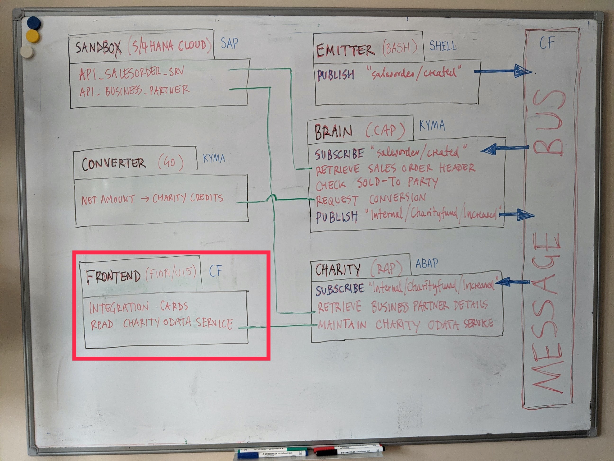

# Web Dashboard

This is a SAPUI5 app represents the dashboard of the project. It visualizes the charity data from the RAP charity service with [UI Integration Cards](https://ui5.sap.com/test-resources/sap/ui/integration/demokit/cardExplorer/index.html).


## Overview

The context in which it runs is shown as the highlighted section of the whiteboard:



## Running the app locally

### With sample data

1. Install deps `npm install` 
2. Replace the first route in the `xs-app.json` with
    ```
    {
      "source": "^/sap/credits",
      "target": "/credits.json",
      "localDir": "sample"
    }
    ```
3. Run Approuter `npm start`
4. Access <http://localhost:5000/> to test the integration cards


### With real data

1. Install deps `npm install` 
2. Add a new `default-env.json` file to simulate the destination to the backend:
    ```
    {
      "destinations": [
        {
          "name": "rap",
          "type": "HTTP",
          "Authentication": "BasicAuthentication",
          "ProxyType": "Internet",
          "url": "https://___.abap.eu10.hana.ondemand.com/sap/opu/odata/sap/Z_UI_C_CSTDONCREDITS_R"
        }
      ]
    }
    ```
3. Run Approuter `npm start`
4. Access <http://localhost:5000/> to test the integration cards. You will see a BasicAuth prompt from the RAP service.

## Deploy to SAP Cloud Platform

Prior to any deployment, create a destination named `rap` in the SAP Cloud Platform cockpit. This destination shall point to the RAP Charity OData service and specify the applied authentication parameters..


1. [Subscribe to the Launchpad service](https://developers.sap.com/tutorials/cp-portal-cloud-foundry-getting-started.html)
2. Build the project with `mbt build`
3. Deploy with `cf deploy mta_archives/developer-keynote-dashboard_1.0.0.mtar`
4.  Access <https://your-id.launchpad.cfapps.eu10.hana.ondemand.com/developerkeynote.dashboard>

